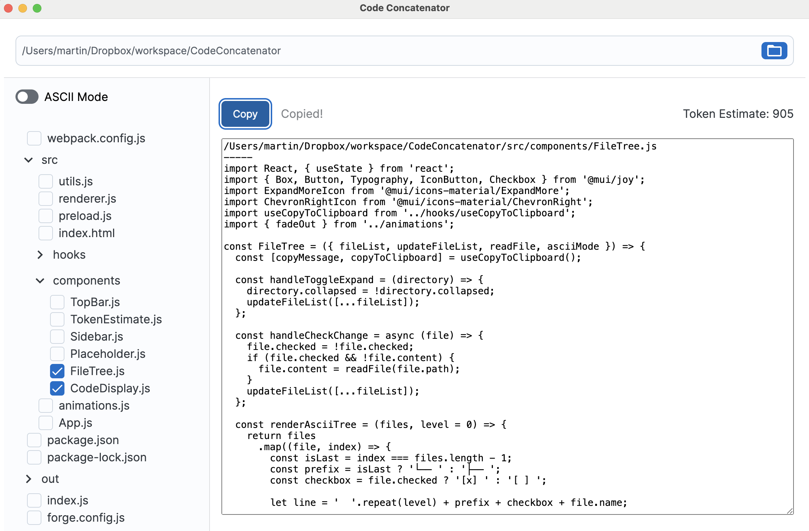

# CodeConcatenator
Easily select files in your project and concatenate their source code for pasting into ChatBots




### Features

🌳 View your files in a tree structure and select them to load their contents into a text area

📜 ASCII mode for the file tree so you can paste in your directory/file structure as well

👀 Watches for changes in your working directory and updates both contents and file tree

🙈 Respects your .gitignore

🔢 Token estimation

## Download 

You can currently download a compiled artifact for running on Mac. For Windows and Linux, you can check out the code and build/run it yourself.

### Mac
[CodeConcatenator-1.0.0.dmg](https://github.com/martin-wintz/CodeConcatenator/releases/download/v1.0.0/CodeConcatenator-1.0.0.dmg)

_Note: This application is not yet notarized with Apple. When opening for the first time, right-click the .dmg file, select Open, and choose to open the application anyway, ignoring Gatekeeper's warning (You may have to right-click -> Open a second time if you don't see the "Open" option initially). Afterwards, it will no longer show the warning._

Alternatively, check out the code and build it yourself.

## Building locally

Install NodeJS (Tested on Node v20.1.0)
Clone the repository.
Run:

```bash
npm install
npm run build
npm start
```
